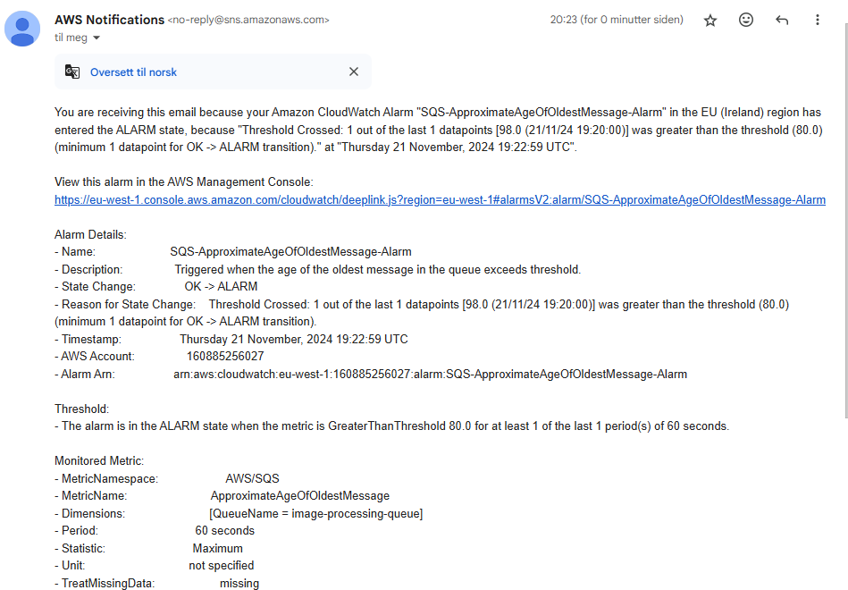

# PGR301 DevOps i Skyen - Kandidat 42

## Oppgave 1

a) HTTP Endepunkt for lambdafunksjon som kan testes med Postman:

https://n60393cta5.execute-api.eu-west-1.amazonaws.com/Prod/generate-image

(AWS access og secret keys ligger tilgjengelig i .pdf filen av sikkerhetsmessige
årsaker, vil ikke legge det til på GitHub hvor bots kan finne dem)

b) Lenke til kjørt GitHub Actions workflow (som har deployet SAM-applikasjone):
https://github.com/henaaro/devops/actions/runs/11910430238

---

## Oppgave 2

a) Kode finnes i mappen "infra", i main.tf
b) Lenke til kjørt Actions workflow:
https://github.com/henaaro/devops/actions/runs/11914158217

Lenke til fungerende GitHub Actions workflow (ikke main):
https://github.com/henaaro/devops/actions/runs/11920602646

SQS-Kø URL:
https://sqs.eu-west-1.amazonaws.com/160885256027/image-processing-queue

---

## Oppgave 3
a) Koden finnes i filen "Dockerfile" i mappen java_sqs_client
b) Hvordan jeg har valgt å tagge container imagene mine og hvorfor:
1. Latest Tag  
        Latest taggen representerer den nyeste versjonen av docker
        imaget. Når en ny commit blir pusha, bllir imaget bygget og
        tagget med main. Da blir det enkelt for teamet å alltid få
        tilgang til den siste stabile versjonen av imaget.
2. "commit-sha" tag:
        Hver gang jeg commiter blir en unik sha-hash generert, så jeg
        valgte å bruke denne hashen som en tag for docker imaget. Da
        blir det mulig å identifisere og referere til eksakte versjoner
        av imaget knyttet til spesifikke commits. Dette hjelper når det
        gjelder feilsøking og presis versjonskontroll.

Docker image:
waaro/java-sqs-client

(AWS access og secret keys ligger fremdeles tilgjengelig i .pdf filen)

---

## Oppgave 4

Har lagt til min egen mail her, så vet ikke helt hvordan det vil være for sensor
å sjekke at det funker, men koden ligger i:
main.tf, variables.tf og terraform.tfvars

Som en kan se på bildet over, og muligens på AWS panelet, kan man se at mailen sendes
når kravene er oppfylt.

---

## Oppgave 5

**Serverless arkitektur vs Mikrotjenestebasert arkitektur**

Ettersom disse to arkitekturene er så forskjellige, vil de selvsagt ha
forskjellige fordeler og ulemper

1. Automatisering og kontinuerlig levering (CI/CD)

Når man jobber med serverless er det lettere å sette opp automatisering, da man, som navnet tilsier, slipper å tenke på serverne.
Lambda funksjoner kan rulles ut automatisk, så du kan fokusere mer på selve koden.
Dette kan gjøre CI/CD-pipelines enklere og raskere, men det kan også bli litt rotete å holde styr på alle funksjonene som kjører på ulike steder.
Dette kan føre til at man mister litt oversikten.

Mikrotjenester er på den andre siden mye mer kontrollert.
Siden du med dette har mange flere små deler og tjenester som må jobbe sammen, kan det CI/CD-pipelinen bli mer komplisert.
Til gjengeld sitter du igjen med større kontroll over hver del, også på utrulling og versjonsstyring.

2. Observability (overvåkning)

Gjennom serveless blir du veldig bundet til dine valgte verktøy.
Du blir nødt til å stole på verktøy som CloudWatch for logging, og kan i mindre grad hardkode en løsning som dekker kun dine behov.
Du har da ikke tilgang til detaljert innsikt i infrastrukturen, som kan gjøre feilsøkingen noe mer krevende.
Dette er et ikke-problem når det gjelder mikrotjenester, men på den andre siden er du nødt til å sette opp alt selv.
Dette kan fort bli svært krevende, avhengig av hva slags scope du har, i forhold til "ferdige" løsninger som AWS.

3. Skalerbarhet og kostnadskontroll

Når det gjelder kostnader er det veldig "enkelt" med serverless, da det gir en bra skalerbarhet.
Lambda tar hånd om trafikkøkninger for deg, og som et resultat betaler du kun for det du bruker.
Ulempen med dette er selvsagt at det kan være vanskelig å forutsi akkurat hvor stor regningen vil bli på.
Med mikrotjenester kan du lettere skalere hver enkelt tjeneste, men du må dermed sørge for selv at alle tjenestene er riktig dimmensjonert. 
Om du ikke har god nok kontroll her selv, kan det resultere i at du har faste kostnader på enkelte tjenester som langt overstrider hva du faktisk trenger, som er et ikke-problem i serverless.

4. Eierskap og ansvar

Med serverless ligger ansvaret for infrastrukturen i stor grad hos leverandørene, som i denne eksamenens tilfelle er AWS, som kan være positivt for et DevOps-team.
Du slipper å håndtere servere selv, men til gjengjeld mister du også noe av kontrollen.
Et eksempel på dette vil du være helt avhengig av leverandøren, og om for eksempel AWS plutselig skulle forsvinne, vil løsningnen din det også.
Det kan også bli vanskeligere å gjennomføre feilsøking.
Mikrotjenester gir i mye større grad fullstendig kontroll, men også derav mer ansvar for hver indivuelle tjeneste.
Ansvaret fører naturlig nok til mer arbeid for teamet, spesielt når det gjelder vedlikehold og overvåkning av serverne.

For å konkludere:

Det er åpenbare styrker og svakheter ved de to variantene.
Veldig kort fortalt er serveless enklere å håndtere, men du får til gjengeld mindre kontroll.
Bruker du mikrotjenester kan du spesialisere deg så mye du ønsker, men det krever mye mer vedlikehold og administrasjon.
Hva du bør velge for din tjeneste vil variere utifra hva du prioriterer, og hva slags kapasitet du har.
Rask deployment og god skalerbarhet eller mer kontroll og tilpassning vil være de viktigste nøkkelordene som separerer serverless og mikrotjenester.

---

## Oppsummeringstabell for leveranser
| oppgave | lenke                                                                                                                                                                                                                                                            |
|---------|------------------------------------------------------------------------------------------------------------------------------------------------------------------------------------------------------------------------------------------------------------------|
| 1a      | https://n60393cta5.execute-api.eu-west-1.amazonaws.com/Prod/generate-image                                                                                                                                                                                       |
| 1b      | https://github.com/henaaro/devops/actions/runs/11910430238                                                                                                                                                                                                       |
| 2a      | [Oppgave 2](#oppgave-2)                                                                                                                                                                                                                                          |
| 2b      | Actions workflow: https://github.com/henaaro/devops/actions/runs/11914158217 GitHub Actions workflow (ikke main): https://github.com/henaaro/devops/actions/runs/11920602646 SQS-Kø URL: https://sqs.eu-west-1.amazonaws.com/160885256027/image-processing-queue |
| 3       | waaro/java-sqs-client                                                                                                                                                                                                                                            |
| 4       | [Oppgave 4](#oppgave-4)                                                                                                                                                                                                                                          |
| 5       | [Oppgave 5](#oppgave-5)                                                                                                                                                                                                                                          |
